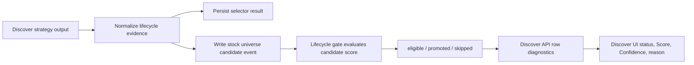

# Discovery Lifecycle Scoring And Auto Entry Diagnostics

## Story / Capability Summary

Discovery results now publish the structured lifecycle evidence required by the quant auto-entry flow. The fix closes the gap where discovery output, especially AI scanner output, was reduced to display text and reached lifecycle scoring with `source_score=0` and `confidence=0`.

The completed capability normalizes discovery candidates before lifecycle ingestion, preserves AI scanner evidence, persists candidate-event diagnostics, and shows score/confidence/status evidence in the discover API and UI.

## User-Facing Behavior

- Running a discover strategy can create lifecycle candidate events with usable score, confidence, trend, and technical confirmation evidence.
- AI scanner candidates retain `scanner_score`, technical score, theme score, sector score, technical reasons, trend, and confirmation count.
- Non-AI strategies without explicit scores can receive derived score/confidence only from measurable evidence such as rank, market data completeness, liquidity, technical fields, and strategy numeric fields.
- Source identity alone never adds score. Rows with only a source name or display reason remain zero-score and carry `insufficient_measurable_evidence`.
- Discover rows show lifecycle status, score, confidence, and blocking reason so users can see why a stock is eligible, skipped, already in quant, or blocked.
- Discover task status exposes `result.quantAutoEntry` counts for attempted, events, promoted, eligible, and skipped candidates.

## Workflow

## Rules Applied

- `PIR-001`: OpenSpec artifacts identify target code paths for each feature point.
- `PIR-002`: Modified/generated code files stay at or below 1000 lines.
- `PIR-003` and `CFG-005`: Existing SQLite/MySQL DB runtime is reused; no schema migration was added.
- `PIR-004`: Existing discover and task APIs are extended without route ownership changes.
- `PIR-005` and `CFG-008`: Discover strategy execution remains asynchronous through the existing task flow.
- `PY-001`, `PY-003`, `PY-007`, `PY-008`: Python code follows project layout, safe imports, explicit fallback/error behavior, and no secret handling.
- `TEST-001`, `TEST-002`, `TEST-003`, `TEST-007`, `TEST-008`, `TEST-010`: Tests use explicit OpenSpec parameter files, meaningful assertions, isolated fake data, and recorded coverage evidence.

## Design Summary

The normalization boundary lives in `app/discover/lifecycle_scoring.py`. It returns a discovery row enriched with:

- `source_score` and `score`
- `confidence` and `candidate_confidence`
- `trend`
- `technical_confirmation_count`
- `lifecycle_score_diagnostics`

Explicit evidence wins. For AI scanner rows, `scanner_score` becomes the score evidence when no stronger explicit score exists, and confidence is derived from technical, theme, sector, and market-data quality. For non-AI rows, the fallback formula uses measurable evidence only. For source-only rows, score and confidence remain `0.0`.

Candidate event ingestion in `app/gateway/quant_universe_entry.py` persists normalized score, confidence, trend, technical count, technical reasons, and diagnostics. Discover API enrichment preserves positive discover-stage score/confidence when no candidate event exists yet.

## API / Data / UI Impact

`GET /api/v1/discover` candidate rows can include:

- `source_score / score`
- `confidence / candidate_confidence`
- `trend`
- `technical_confirmation_count`
- `lifecycle_score_diagnostics`
- `eligible_status / blocking_reason / already_in_quant`

`POST /api/v1/discover/actions/run-strategy` still returns a task id. `GET /api/v1/tasks/{task_id}` can return `result.quantAutoEntry` with attempted, events, promoted, eligible, and skipped details.

The UI renders lifecycle status plus `Score` and `Confidence` badges through `EligibleBadge`. No database schema migration, lifecycle threshold change, old record rewrite, realtime buy/sell logic change, or manual batch quant behavior change is part of this capability.

## Security and Permissions

No new route, dependency, credential, token, private endpoint, or authentication behavior was introduced. Persisted and displayed diagnostics are limited to stock identifiers, numeric evidence, status values, strategy keys, and machine-readable reason codes.

Tests use fake stock data and isolated temporary SQLite files.

## Operational Notes

- Old selector cache rows are not rewritten by opening discover pages.
- Auto-entry still only runs when discover or research tasks complete.
- `manual_only`, `confirm_first`, and `auto_trial` lifecycle modes keep their existing meaning.
- Lifecycle thresholds, source-family gates, capacity checks, and cooling/manual-ban/non-tradable blockers remain unchanged.
- Source names and display text are for audit and UI only; they do not produce score credit.

## Validation Evidence

Backend:

- `python -m pytest -q tests\test_discover_lifecycle_scoring.py tests\test_ui_backend_api_actions.py::test_discover_snapshot_exposes_read_only_lifecycle_entry_fields tests\test_ui_backend_api_actions.py::test_discover_run_strategy_auto_trial_promotes_discovered_stocks tests\test_ui_backend_api_actions.py::test_discover_run_strategy_executes_real_selector_runners_and_persists_results`
- Result: `14 passed`.

Coverage:

- `app/discover/discover.py`: changed lines `17/17 = 100.0%`
- `app/discover/lifecycle_scoring.py`: new-file statement lines `194/204 = 95.1%`
- `app/gateway/quant_universe_entry.py`: changed lines `18/18 = 100.0%`

Frontend:

- `npm --prefix ui run test -- discover-page.test.tsx`
- Result: `4 passed`.
- `npm --prefix ui run build`
- Result: build completed; Vite reported the existing large-chunk warning.

Quality checks:

- `git diff --check -- <changed files>` exited `0` with line-ending normalization warnings only.
- File length checks confirmed all generated/modified code and test files are at or below 1000 lines.

## Test Parameter and Coverage Evidence

OpenSpec test parameters are stored under:

- `openspec/changes/archive/2026-05-15-fix-discover-lifecycle-scoring/test-params/discovery-lifecycle-normalization.md`
- `openspec/changes/archive/2026-05-15-fix-discover-lifecycle-scoring/test-params/lifecycle-event-handoff.md`
- `openspec/changes/archive/2026-05-15-fix-discover-lifecycle-scoring/test-params/discover-api-ui-diagnostics.md`
- `openspec/changes/archive/2026-05-15-fix-discover-lifecycle-scoring/test-params/final-integrated-discovery-lifecycle.md`

These files define AI structured evidence, non-AI derived evidence, zero-evidence behavior, candidate event handoff, API/UI diagnostics, task auto-entry output, and final completion gates.

## Source Mapping

| Topic | Source |
|---|---|
| Approved behavior | `openspec/changes/archive/2026-05-15-fix-discover-lifecycle-scoring/specs/discover-lifecycle-entry/spec.md` |
| Design decisions | `openspec/changes/archive/2026-05-15-fix-discover-lifecycle-scoring/design.md` |
| Task and validation plan | `openspec/changes/archive/2026-05-15-fix-discover-lifecycle-scoring/tasks.md` |
| Per-task review closure | `openspec/changes/archive/2026-05-15-fix-discover-lifecycle-scoring/task-reviews.md` |
| Final zero-finding review | `openspec/changes/archive/2026-05-15-fix-discover-lifecycle-scoring/review.md` |
| Normalization implementation | `app/discover/lifecycle_scoring.py` |
| Discover strategy and API shaping | `app/discover/discover.py` |
| Candidate event persistence/enrichment | `app/gateway/quant_universe_entry.py` |
| Discover UI diagnostics | `ui/src/features/discover/discover-page.tsx`, `ui/src/features/quant/quant-entry-controls.tsx`, `ui/src/lib/page-models.ts` |
| Backend tests | `tests/test_discover_lifecycle_scoring.py` |
| Frontend tests | `ui/src/tests/discover-page.test.tsx` |
