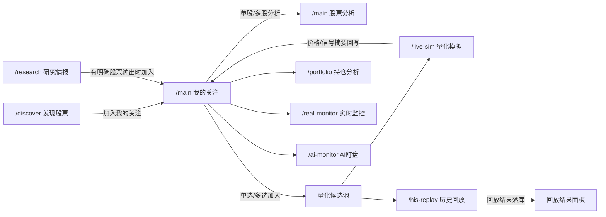

# 工作流与数据流说明

本文档描述**当前**系统的主工作流和数据流，重点解释：

- 页面是怎么串起来的
- 数据写到哪里
- 页面从哪里读
- 哪些结果会继续回写到主工作台

当前主架构：

- 前端：`ui/` 单页面应用
- 网关： [app/gateway_api.py](/C:/Projects/githubs/aiagents-stock/app/gateway_api.py)
- 运行入口： [app/gateway.py](/C:/Projects/githubs/aiagents-stock/app/gateway.py)

## 1. 当前主工作流

当前推荐主线是：

`发现股票 / 研究情报 -> 我的关注 -> 量化候选池 -> 量化模拟 / 历史回放`

角色分工：

- `发现股票`：筛出候选股票
- `研究情报`：输出板块、资金、新闻、宏观判断；只有有股票输出时才支持加入我的关注
- `我的关注`：全局主池，承接你真正关心的股票
- `量化候选池`：从“我的关注”人工推入，用于量化模拟和历史回放
- `量化模拟 / 历史回放`：围绕量化候选池做执行、验证和复盘

## 2. 当前页面工作流图

## 3. 数据流 1：发现股票 -> 我的关注

### 数据来源

发现股票页由这些策略模块聚合：

- 主力选股
- 低价擒牛
- 小市值
- 净利增长
- 低估值

页面路由：
- `/discover`
- 快照接口：`GET /api/v1/discover`

### 页面动作

用户可以：
- 在候选股票表中单只加入我的关注
- 勾选多只后批量加入我的关注

对应动作：
- `POST /api/v1/discover/actions/item-watchlist`
- `POST /api/v1/discover/actions/batch-watchlist`

### 中间处理

桥接层：
- [app/watchlist_selector_integration.py](/C:/Projects/githubs/aiagents-stock/app/watchlist_selector_integration.py)

主要工作：
- 标准化股票代码
- 抽取价格
- 抽取来源策略
- 提取附加元数据

### 落库位置

- [data/watchlist.db](/C:/Projects/githubs/aiagents-stock/data/watchlist.db)
- 核心表：`watchlist`

### 页面回读位置

- `/main`
- `GET /api/v1/workbench`

## 4. 数据流 2：研究情报 -> 我的关注

### 数据来源

研究情报页聚合这些模块：

- 智策板块
- 智瞰龙虎
- 新闻流量
- 宏观分析
- 宏观周期

页面路由：
- `/research`
- 快照接口：`GET /api/v1/research`

### 页面动作

只有模块里明确输出股票时，页面才提供：
- 单只加入我的关注
- 批量加入我的关注

对应动作：
- `POST /api/v1/research/actions/item-watchlist`
- `POST /api/v1/research/actions/batch-watchlist`

### 中间处理

桥接层：
- [app/research_watchlist_integration.py](/C:/Projects/githubs/aiagents-stock/app/research_watchlist_integration.py)

### 落库位置

- [data/watchlist.db](/C:/Projects/githubs/aiagents-stock/data/watchlist.db)

### 页面回读位置

- `/main`
- `GET /api/v1/workbench`

## 5. 数据流 3：我的关注 -> 股票分析

### 数据来源

“我的关注”里的股票来源于：
- 手工添加
- 发现股票结果
- 研究情报结果

### 页面入口

- `/main`
- 快照接口：`GET /api/v1/workbench`

### 页面动作

工作台下半区的股票分析会发起：
- 单股分析：`POST /api/v1/workbench/actions/analysis`
- 批量分析：`POST /api/v1/workbench/actions/analysis-batch`

### 中间处理

主分析链会调用：
- [app/stock_analysis_service.py](/C:/Projects/githubs/aiagents-stock/app/stock_analysis_service.py)
- [app/stock_data.py](/C:/Projects/githubs/aiagents-stock/app/stock_data.py)
- [app/ai_agents.py](/C:/Projects/githubs/aiagents-stock/app/ai_agents.py)

### 结果去向

分析结果直接进入当前页面快照，不写回我的关注作为完整报告。

当前读取位置：
- `/main`
- `/history`

## 6. 数据流 4：我的关注 -> 量化候选池

### 数据来源

“我的关注”表格中的股票。

### 页面动作

工作台里有两条推进路径：
- 行内单只加入量化候选池
- 勾选后批量加入量化候选池

对应动作：
- `POST /api/v1/workbench/actions/batch-quant`

### 中间处理

使用：
- [app/quant_sim/candidate_pool_service.py](/C:/Projects/githubs/aiagents-stock/app/quant_sim/candidate_pool_service.py)
- [app/watchlist_service.py](/C:/Projects/githubs/aiagents-stock/app/watchlist_service.py)

### 落库位置

量化候选池：
- [data/quant_sim.db](/C:/Projects/githubs/aiagents-stock/data/quant_sim.db)
- 表：`candidate_pool`

关注池同步：
- [data/watchlist.db](/C:/Projects/githubs/aiagents-stock/data/watchlist.db)
- 字段：`watchlist.in_quant_pool`

### 页面回读位置

- `/main`
- `/live-sim`
- `/his-replay`

## 7. 数据流 5：量化候选池 -> 量化模拟

### 页面入口

- `/live-sim`
- 快照接口：`GET /api/v1/quant/live-sim`

### 页面动作

| 动作 | 接口 |
|---|---|
| 保存配置 | `POST /api/v1/quant/live-sim/actions/save` |
| 启动模拟 | `POST /api/v1/quant/live-sim/actions/start` |
| 停止模拟 | `POST /api/v1/quant/live-sim/actions/stop` |
| 重置账户 | `POST /api/v1/quant/live-sim/actions/reset` |
| 单只候选分析 | `POST /api/v1/quant/live-sim/actions/analyze-candidate` |
| 删除候选股 | `POST /api/v1/quant/live-sim/actions/delete-candidate` |
| 批量跑候选池 | `POST /api/v1/quant/live-sim/actions/bulk-quant` |

### 中间处理

核心链路：

1. [app/quant_sim/scheduler.py](/C:/Projects/githubs/aiagents-stock/app/quant_sim/scheduler.py)
2. [app/quant_sim/engine.py](/C:/Projects/githubs/aiagents-stock/app/quant_sim/engine.py)
3. [app/quant_sim/signal_center_service.py](/C:/Projects/githubs/aiagents-stock/app/quant_sim/signal_center_service.py)
4. [app/quant_sim/portfolio_service.py](/C:/Projects/githubs/aiagents-stock/app/quant_sim/portfolio_service.py)

### 落库位置

- [data/quant_sim.db](/C:/Projects/githubs/aiagents-stock/data/quant_sim.db)

核心表：
- `strategy_signals`
- `sim_positions`
- `sim_position_lots`
- `sim_account`
- `sim_trades`
- `sim_account_snapshots`
- `sim_scheduler_config`

### 回写到我的关注

量化模拟执行时会把这些摘要回写到我的关注：
- 最新价格
- 最新信号
- 股票名称补全

对应表：
- [data/watchlist.db](/C:/Projects/githubs/aiagents-stock/data/watchlist.db)

### 常见结果

- 最近几轮可能只有 `HOLD`
- 即使开启自动执行，也可能因一手规则跳过
- 跳过原因会保存在 `execution_note`

## 8. 数据流 6：量化候选池 -> 历史回放

### 页面入口

- `/his-replay`
- 快照接口：`GET /api/v1/quant/his-replay`

### 页面动作

| 动作 | 接口 |
|---|---|
| 发起区间回放 | `POST /api/v1/quant/his-replay/actions/start` |
| 发起接续回放 | `POST /api/v1/quant/his-replay/actions/continue` |
| 取消任务 | `POST /api/v1/quant/his-replay/actions/cancel` |
| 删除任务 | `POST /api/v1/quant/his-replay/actions/delete` |

### 中间处理

核心链路：

1. [app/quant_sim/replay_service.py](/C:/Projects/githubs/aiagents-stock/app/quant_sim/replay_service.py)
2. [app/quant_sim/replay_runner.py](/C:/Projects/githubs/aiagents-stock/app/quant_sim/replay_runner.py)
3. 历史快照 provider
4. checkpoint 逐轮生成信号
5. 写入回放结果

### 落库位置

- [data/quant_sim.db](/C:/Projects/githubs/aiagents-stock/data/quant_sim.db)

核心表：
- `sim_runs`
- `sim_run_checkpoints`
- `sim_run_signals`
- `sim_run_trades`
- `sim_run_snapshots`
- `sim_run_positions`
- `sim_run_events`

### 页面回读位置

- `/his-replay`
- 快照接口：`GET /api/v1/quant/his-replay`

## 9. 数据流 7：量化结果 -> 我的关注

### 目的

让工作台首页的“我的关注”不是静态股票清单，而是能看到：
- 最新价格
- 最新量化信号
- 是否已在量化候选池

### 回写字段

回写内容包括：
- `latest_price`
- `latest_signal`
- `stock_name`
- `updated_at`

### 最终效果

在 `/main` 里，用户可以直接看到：
- 当前名称
- 当前现价
- 当前状态
- 是否已在量化候选池

## 10. 持仓分析、实时监控、AI盯盘

这三条线不在主工作流里，但都和工作台相连。

### 持仓分析

- 路由：`/portfolio`
- 接口：`GET /api/v1/portfolio`

定位：
- 面向已持仓股票的分析与组合管理

### 实时监控

- 路由：`/real-monitor`
- 接口：`GET /api/v1/monitor/real`

定位：
- 规则式监控、提醒和触发记录

### AI盯盘

- 路由：`/ai-monitor`
- 接口：`GET /api/v1/monitor/ai`

定位：
- 更连续、更智能的单票分析与任务化跟踪

## 11. 为什么系统会觉得“数据流乱”

旧问题主要来自：

1. 发现股票结果以前容易停留在各策略页内部
2. 我的关注和量化候选池容易被混成一个对象
3. 研究情报不是天然股票列表，但有时又会输出股票
4. 页面和服务边界过去不够稳定

当前这版已经尽量收成：

`发现股票 / 研究情报 -> 我的关注 -> 量化候选池 -> 量化模拟 / 历史回放`

## 12. 当前应继续保持稳定的边界

后续继续重构时，建议继续保持：

1. 前端页面只通过 [app/gateway_api.py](/C:/Projects/githubs/aiagents-stock/app/gateway_api.py) 获取快照与触发动作
2. 业务逻辑仍然留在 `app/` 下现有模块
3. “我的关注”与量化候选池继续分层
4. 量化模拟与历史回放继续共用同一量化候选池
5. 有明确股票输出的发现/研究页才允许加入我的关注

