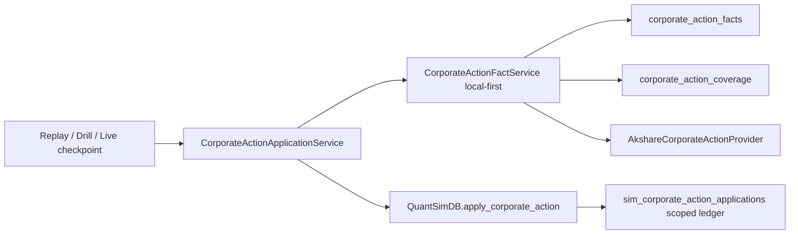

# stock-corporate-action-facts Design

## Workflow Lane

本变更使用 full OpenSpec lane：brainstorm -> spec/design -> tasks -> implementation -> completion。原因是该需求涉及数据库、回放/演练/live 调度、会计幂等和 E2E 验证。

## Lightweight Design Scope

本设计只覆盖公司行为事实层、local-first 获取、due action 会计应用和验证。它不调整交易策略、不新增 UI、不新增公开 API、不实现港股/美股完整公司行为语义。

## Source Mapping

- Brainstorm/context: `.agent/workdir/sp-openspec/stock-corporate-action-facts/brainstorm.md`、`context.md`。
- Rules: `docs/rules/project-implementation-standards.md`、`python-code-standards.md`、`configuration-standards.md`、`testing-standards.md`、`logging-standards.md`、`encoding-standards.md`。
- Existing implementation:
  - `app/quant_sim/corporate_actions.py`
  - `app/quant_sim/db.py`
  - `app/quant_sim/replay_service_historical.py`
  - `app/quant_sim/replay_service_drill.py`
  - `app/quant_sim/scheduler.py`
  - `app/quant_sim/market_technical_artifact.py`
  - `app/quant_sim/market_technical_artifact_store.py`

## Rules Compliance

- PIR-001：本 design 列出目标代码路径。
- PIR-002：新增逻辑优先放到 focused module，避免继续扩大 `db.py`。
- PIR-003：本变更需要数据库；本地 SQLite，部署目标 MySQL，不新增连接池。
- PIR-004：不新增公开 API。
- PIR-005：不新增长耗时 API；job 调度路径使用现有异步/后台机制。
- PIR-006：replay、drill、live 复用同一个 due application service。
- PIR-007/PIR-008：需要 job/system E2E，用户已确认完成后跑实时量化演练。
- PIR-009：用户已确认 backend live due action 行为；UI/API/config 不适用。
- PIR-010：不做旧数据兼容，不添加未要求 fallback。
- PIR-011/PIR-012：新增日志和中文文档需要 UTF-8、无敏感日志。

## Spec Gaps

无阻塞 spec gap。第一阶段不支持的公司行为类型由 spec 明确为 persisted but not applied。

## Current Behavior

`AkshareCorporateActionProvider` 只做进程内缓存和 Akshare 分红数据规范化。历史回放在每个 checkpoint 前调用 `_apply_due_corporate_actions()`，按当前持仓股票从 provider 获取动作并调用 `QuantSimDB.apply_corporate_action()`。

`sim_corporate_action_applications` 是会计应用账本，当前不是股票事实表。live scheduler `QuantSimScheduler.run_once()` 在交易时间内会先做 outcome scoring、列持仓、扫描候选、执行信号、写快照，但还没有在这些动作前统一应用 due 公司行为。

## Target Architecture

新增三层：

1. Provider adapter：继续负责把外部 Akshare/Sina 风格 payload 规范化为项目内部 `CorporateActionFact`，但不再承担持久化语义。
2. Fact store/service：负责公司行为事实和覆盖记录的 local-first 查询、远程补齐、落库、诊断。
3. Application service：负责在 live/replay/drill checkpoint 前查 due facts，并调用现有会计应用逻辑，应用账本按 scope 幂等。

## Architecture Impact

- 新增股票级事实层，独立于 `market_technical_artifact`。
- replay/drill/live 三条路径从直接 provider 查询改为统一 application service。
- 现有 `QuantSimDB.apply_corporate_action()` 保留为底层会计应用能力，但其幂等 identity 从单纯 `stock_code + ex_date` 扩展为 scoped action identity。
- 不改变交易策略、候选评分、信号评分和 UI 页面。
- 不引入新外部依赖。

## Code Path Plan

### New modules

- `app/quant_sim/corporate_action_facts.py`
  - `CorporateActionFact`
  - `CorporateActionCoverage`
  - `CorporateActionQuery`
  - `CorporateActionFactStore`
  - `CorporateActionFactService`
  - `CorporateActionApplicationService`

### Modified modules

- `app/quant_sim/corporate_actions.py`
  - Keep Akshare normalization.
  - Add action type and raw payload mapping.
  - Keep fake provider injection for tests.

- `app/quant_sim/db.py`
  - Initialize `corporate_action_facts` and `corporate_action_coverage`.
  - Adjust `sim_corporate_action_applications` schema to record `scope_type`, `scope_id`, `market`, `action_ref`, `action_type`.
  - Extend `apply_corporate_action()` to accept a named command object or explicit scope object if input count would exceed five.

- `app/quant_sim/replay_service_historical.py`
  - Replace direct provider query in `_apply_due_corporate_actions()` with `CorporateActionApplicationService.apply_due_actions(...)`.
  - Pass replay scope: `scope_type="historical_replay"` and `scope_id=run_id` where available; temp DB remains run-local but ledger still records scope.

- `app/quant_sim/replay_service_drill.py`
  - Reuse the same inherited due action application path.
  - Pass drill scope: `scope_type="live_quant_drill"` and `scope_id=run_id`.

- `app/quant_sim/scheduler.py`
  - In `QuantSimScheduler.run_once()`, after trading-time check and `current_time` calculation, call the same application service with live scope before outcome scoring, listing positions, scanning candidates, auto execution and account snapshot.
  - Read-only live-sim GET SHALL NOT apply due actions implicitly.

- `app/quant_sim/market_technical_artifact*.py`
  - No full company action payload.
  - Optional only if implementation needs lightweight status/ref diagnostics.

## Generated Code Paths

实施阶段预计新增或修改：

- `app/quant_sim/corporate_action_facts.py`
- `app/quant_sim/corporate_actions.py`
- `app/quant_sim/db.py`
- `app/quant_sim/replay_service_historical.py`
- `app/quant_sim/replay_service_drill.py`
- `app/quant_sim/scheduler.py`
- `tests/test_corporate_action_facts.py`
- `tests/test_quant_sim_scheduler.py`
- affected replay/drill tests as needed

## Data Design

### `corporate_action_facts`

Required columns:

- `id`
- `action_ref` unique
- `stock_code`
- `market`
- `action_type`
- `ex_date`
- `record_date`
- `bonus_share_ratio`
- `cash_dividend_per_share`
- `description`
- `provider`
- `source_status`
- `reason_code`
- `data_version`
- `raw_json`
- `fetched_at`
- `created_at`
- `updated_at`

Unique key:

- `stock_code, market, action_type, ex_date, record_date, data_version`

`action_ref` generation:

- Deterministic format: `ca:{data_version}:{market}:{stock_code}:{action_type}:{ex_date}:{record_date}:{bonus_share_ratio}:{cash_dividend_per_share}`
- Each component must use normalized text/decimal formatting before concatenation.
- `record_date` may be empty text when provider lacks it.
- The implementation may hash the deterministic string for storage length, but the hash input must be this normalized identity string and must remain stable across runs.
- Random UUIDs, database ids, provider row offsets, and fetch timestamps are forbidden in `action_ref`.

Supported first-slice `action_type` values:

- `cash_dividend`
- `bonus_share`
- `share_transfer`
- `mixed_dividend_share`
- `unsupported`

When provider data lacks `record_date`, store normalized empty text for identity rather than dropping a valid `ex_date` event.

### `corporate_action_coverage`

Required columns:

- `id`
- `stock_code`
- `market`
- `start_date`
- `end_date`
- `provider`
- `source_status`
- `reason_code`
- `facts_count`
- `checked_at`
- `retry_after`
- `valid_until`
- `created_at`
- `updated_at`

Unique key:

- `stock_code, market, start_date, end_date, provider`

Status:

- `local_hit`
- `remote_fetched`
- `empty_range`
- `provider_failed`
- `partial_missing`

### `sim_corporate_action_applications`

Required additions:

- `scope_type`
- `scope_id`
- `market`
- `action_ref`
- `action_type`

Application uniqueness:

- `scope_type, scope_id, stock_code, market, action_ref`

Scope ids:

- live: `scope_type="live"`, `scope_id="live"`
- historical replay: `scope_type="historical_replay"`, `scope_id=str(run_id)` when available; for run-local temp DB setup, use the durable run id passed by replay service
- live quant drill: `scope_type="live_quant_drill"`, `scope_id=str(run_id)`

For SQLite local DB, schema initialization may use `CREATE TABLE IF NOT EXISTS` and guarded `ALTER TABLE` helpers following existing project patterns. For MySQL deployment, generated SQL must avoid SQLite-only `INSERT OR REPLACE` semantics in new service SQL; use existing runtime abstraction or write dialect-aware upsert helpers where needed.

No new database runtime or connection pool is introduced. The implementation SHALL use the existing `QuantSimDB`/`DatabaseRuntime` connection behavior and keep connection pool size within existing project limits.

## Data Impact

- New durable stock facts:
  - `corporate_action_facts`
  - `corporate_action_coverage`
- Existing scoped accounting ledger:
  - `sim_corporate_action_applications` gains scope/action identity fields.
- Existing position, lot, slot allocation and account tables continue to be updated only through the accounting application path.
- `market_technical_artifact` does not duplicate full corporate action facts.
- No existing historical data migration is required because user accepted database reset.

## Database Decision

Database is required.

- Local development: SQLite.
- Deployment target: MySQL-compatible schema/queries.
- Connection pool: use existing project database runtime; do not introduce a new pool.
- New SQL must avoid SQLite-only upsert syntax unless hidden behind existing dialect-aware runtime behavior.
- Schema initialization may follow current `QuantSimDB` guarded create/alter pattern for local reset.

## Local-first Semantics

1. `CorporateActionFactService.get_actions(query)` first checks facts within `stock_code + market + date range`.
2. If facts exist for the requested date range and coverage indicates the range was checked, return facts with `local_hit`.
3. If facts exist but coverage is missing or narrower than the requested range, return matching facts and fetch only the uncovered sub-range.
4. If an `empty_range` coverage exists for the requested range and is still valid, return empty with `empty_range`.
5. If a `provider_failed` coverage exists and `retry_after` / `valid_until` has not expired, return diagnostic with `provider_failed` unless caller explicitly forces refresh. This change does not add public force-refresh behavior.
6. If local coverage is insufficient, call provider once for the uncovered range, save facts and coverage, then return facts with `remote_fetched` or empty with `empty_range`.

Coverage validity:

- Past ex-date facts are treated stable after fetched.
- Empty coverage for historical ranges remains valid for rerun performance unless a future explicit refresh feature is added.
- `empty_range` is stable for historical ranges.
- `provider_failed` is transient and must have retry metadata. It is not a stable proof that the range has no actions.

Retry defaults:

- `provider_failed_retry_minutes = 30`
- `retry_after = checked_at + 30 minutes`
- `valid_until = retry_after`
- The same default applies to historical and current ranges in this slice.
- This is an internal constant, not a user-facing configuration key.

## Due Action Application Order

For each checkpoint:

1. Determine current positions before valuation.
2. Query due facts for held stocks where `ex_date <= checkpoint.date()` and the scoped application ledger has no matching application.
3. Filter unsupported facts.
4. Apply supported facts through scoped application command.
5. Continue outcome scoring, lifecycle, signal generation, auto execution and account snapshot.

Live scheduler order:

1. trading-time check
2. current checkpoint time
3. apply due corporate actions for live scope
4. outcome scoring
5. position/candidate scan
6. auto execution
7. lifecycle updates
8. account snapshot

Read-only gateway snapshots MUST NOT call due application service.

## Reuse / Common Logic Plan

- Reuse existing `apply_corporate_action()` accounting behavior for lot, slot, cash and position adjustment.
- Extract due action orchestration into `CorporateActionApplicationService` so replay, drill and live share one path.
- Reuse existing provider normalization code but wrap it behind `CorporateActionFactService`.
- Keep `market_technical_artifact` as a separate facts layer; do not duplicate company action facts into it.

## Requirement Scope / Fallback Decisions

- No old DB migration compatibility; local/deployment reset is accepted by user.
- No silent fallback from provider failure to “no action”.
- No live-sim GET side-effect writes.
- Unsupported event types are persisted but not applied.
- No public API or UI change in this slice.

## Method / Parameter Plan

Use named data objects when more than five inputs are needed:

- `CorporateActionQuery`
- `CorporateActionFact`
- `CorporateActionApplicationCommand`
- `CorporateActionScope`

`apply_corporate_action()` should accept a command object or retain a narrow wrapper; implementation must not add a long parameter list beyond the project rule.

## Logging / Traceability

Add structured logs for:

- `corporate_action_local_hit`
- `corporate_action_remote_fetch`
- `corporate_action_provider_failed`
- `corporate_action_due_applied`
- `corporate_action_already_applied`
- `corporate_action_unsupported_skipped`

Safe fields:

- `trace_id`
- `scope_type`
- `scope_id`
- `stock_code`
- `market`
- `action_ref`
- `ex_date`
- `source_status`
- `reason_code`
- `facts_count`

Do not log provider raw payload or credentials.

## Encoding / Mojibake Plan

- Code reason codes use ASCII.
- Chinese descriptions from provider may be stored in UTF-8 text/JSON.
- Tests with Chinese payload must be readable and not mojibake.

## API Impact

No new public API is required.

Existing job/system entry points used for verification:

- historical replay run
- live quant drill run
- live scheduler `run_once`

## OpenAPI / Backend Layering

No OpenAPI changes.

Backend layering:

- Scheduler/replay services orchestrate checkpoint flow.
- `CorporateActionApplicationService` owns due-action orchestration.
- `CorporateActionFactService` owns local-first fetch and provider mapping.
- `CorporateActionFactStore` owns persistence.
- Provider adapter owns external payload normalization only.

Controllers/gateway modules are not changed by this slice.

## API Path / Parameter Confirmation

不适用。本变更不新增或修改用户可调用 API path、query parameter、path parameter、request body 或 response contract。验证通过既有 job/system entry point 完成。

## UI Impact

No UI change. No mockups required.

## UI Mockup / Functional Description

不适用。本变更没有 UI 控件、页面布局、交互或文案变化。公司行为诊断通过 job/log/test evidence 验证。

## Browser / UI QA Plan

Not applicable. This change has no UI behavior and no browser-visible controls. Job/API/system verification is sufficient.

## Configuration Impact

No new user-facing configuration keys.

Internal constants:

- `data_version = "ca_v1"`
- provider name defaults to `"akshare"`
- `provider_failed_retry_minutes = 30`

These are implementation constants, not runtime settings.

## Configuration Parameter Confirmation

无用户可配置参数。本设计确认以下内部常量，不暴露到设置页或环境变量：

- `data_version = "ca_v1"`
- `provider = "akshare"`
- `provider_failed_retry_minutes = 30`

## Integration Impact

- External provider integration remains Akshare-compatible through existing provider adapter.
- Automated tests must use fake provider/fixtures; real provider availability is not tested.
- Provider failures are mapped to `provider_failed` coverage with retry metadata.
- No credentials or secrets are introduced.

## Security Impact

- No authentication/authorization changes.
- No new public API exposure.
- Logs must not include raw provider payload, credentials, tokens, cookies, sessions, or full sensitive account state.
- DB writes are limited to project-owned local/live/replay databases using existing runtime paths.

## Error Handling

- Provider exception -> `provider_failed` coverage with retry metadata and safe reason code.
- Unsupported action type -> persisted fact with unsupported/raw-only status and skipped application.
- Already applied action -> no-op with `already_applied` diagnostic.
- Missing scope id -> implementation should reject application with explicit reason rather than silently using a global scope.
- Partial local coverage -> fetch uncovered range only, preserving known local facts.

## Compatibility / Migration

No compatibility migration is required. User has repeatedly approved deleting/rebuilding local/deployment databases for this pre-production project.

The implementation must not add legacy dual-path behavior. Existing old rows without new scope/action fields are not required to be preserved.

## E2E Decision

Real E2E is required because the behavior affects replay/drill/live job execution and user-visible performance/accounting results.

Confirmed user expectation:

- 完成后跑一次实时量化演练，确保性能提升后汇报。

E2E design:

- Runtime target: local project runtime.
- Command/tool: project-supported live quant drill entry point or existing script/API used by prior drill runs.
- Test data: current quant universe, a bounded historical date range that includes at least one known or fixture-backed corporate action when possible.
- Assertions/evidence:
  - drill completes successfully;
  - corporate action fact table has local facts/coverage records;
  - repeated run uses local facts instead of repeated remote provider calls where coverage exists;
  - no live state pollution from drill;
  - account/trade snapshots remain coherent.

If no actual due action appears in the selected real run, standalone automated tests must still prove due action application with fixtures, and E2E reports `no_due_action_in_real_range` for live data.

## Standalone Verification Plan

Automated tests:

- fact store inserts and reads supported facts.
- local-first avoids provider call after facts/coverage exist.
- empty coverage avoids repeated provider call.
- provider failure is not treated as empty.
- replay/drill application scope is isolated from live.
- live scheduler applies due action before account snapshot using fake provider/facts.
- unsupported event persists but is skipped by application.

Command-level verification:

- run targeted pytest suite for corporate action facts and affected replay/scheduler tests.
- run a live quant drill after implementation and compare diagnostics/performance.

Coverage target:

- changed/affected code >= 85% coverage, with scenario mapping recorded in implementation review.

## Test Strategy

Test levels:

- Unit/service tests for action normalization, deterministic `action_ref`, local-first coverage, provider failure retry, unsupported skip, scoped idempotency.
- Scheduler/replay integration-style tests using fake provider/store to verify checkpoint order.
- E2E/job verification with live quant drill after implementation.

Tests must not target Akshare correctness or availability.

## Project-Code Test Boundary

Tests SHALL verify project-owned behavior:

- provider response mapping from fixture to `CorporateActionFact`
- fact persistence and coverage behavior
- due-action application ordering and idempotency
- live/replay/drill scope isolation
- diagnostics/log-safe reason codes

Tests SHALL NOT assert real provider schema stability or network availability.

## Real E2E Test Design

Entry point:

- Existing live quant drill workflow used by current project.

Run shape:

- Use current quant universe and a bounded date range.
- Run once to populate facts/coverage.
- Run again to verify local-first reuse.

Required evidence:

- run ids/status;
- elapsed time or provider call count evidence where available;
- counts of `corporate_action_facts` and `corporate_action_coverage`;
- due action application count or `no_due_action_in_real_range` note;
- no live-state pollution from drill.

## Multi-Lens Planning Review

- Requirement alignment: all brainstorm requirements have corresponding spec scenarios.
- Data boundary: corporate action facts are separate from market technical artifact.
- Decision chain: local-first and due-application order are explicit.
- Evidence timing: `action_ref`, coverage status, retry time and application ledger are captured at source/fetch/application moments.
- Determinism: `action_ref` generation and application idempotency use deterministic keys.
- Security: no new public API, no sensitive logs.

## Project Learning Candidates

If implementation confirms performance benefit, update `docs/ai-context/project-learnings.md` during `/sp-complete` with the pattern: stable stock facts should be separated from checkpoint artifacts and reused local-first across live/replay/drill.

## Customer/User Confirmation Evidence

- Backend logic: user confirmed live-sim/live quant must apply due corporate actions at each trading checkpoint/valuation before decisions/valuation.
- UI: not applicable, no UI change.
- API: not applicable, no public API change.
- Config: user-facing config not applicable; internal constants only.
- E2E: user requested real drill after completion; design treats E2E as required.

## Customer Confirmation / Goal-Mode Decision Record

用户已确认：

- live-sim / 实时量化必须在每次交易 checkpoint / 估值前自动应用 due corporate actions。
- 后续直接完成所有流程。
- 完成后跑一次实时量化演练，验证性能提升并汇报。

本设计不需要额外 UI/API/config 用户确认，因为对应范围均为不适用或内部常量。
